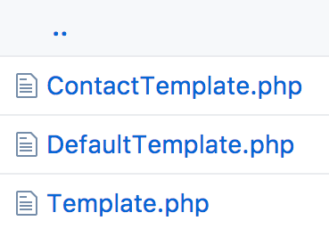
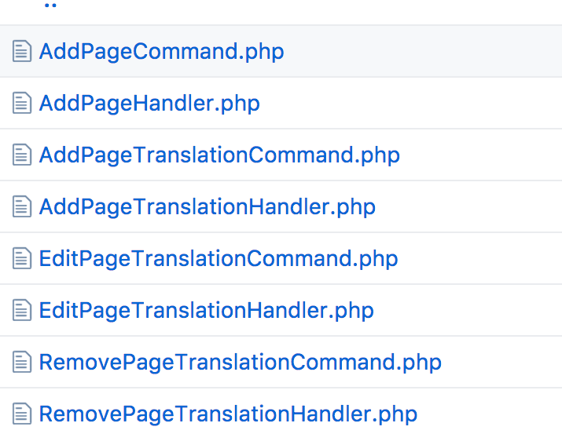
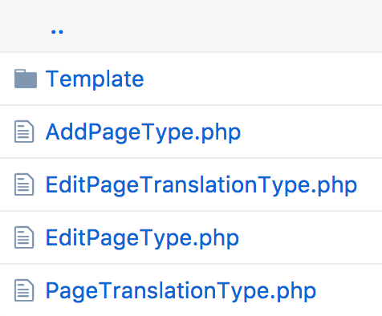
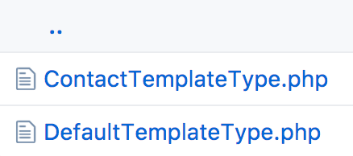

# Using with the LIN3S Admin Bundle

In this chapter will explain how to integrate the [Lin3sAdminBundle][1] with this package. For this purpose it needs the
authentication flow so, it also integrates the **[BenGorUserBundle][2]**.

The installation can be hard so, to simplify this recursive process this package provides an [admin-cms][3]
git branch that works as a boilerplate for projects that need a CMS.

This is the explanation about to create a new translatable resource (also it can have template management)
with integration in the LIN3S Admin Bundle.

**1.** Firstly, create the Domain model with its aggregates, entities and value objects. Also, create the application
commands to satisfy the customer's use cases.






**2.** After that declare created command handlers as a service:
```bash
services:
    app.application.command_handler.page.add:
        class: App\Application\Command\Page\AddPageHandler
        arguments:
            - "@app.repository.page"
            - "@lin3s_cms_kernel.page.template_factory"
        tags:
            -
                name: command_handler
                handles: App\Application\Command\Page\AddPageCommand

    app.application.command_handler.page.add_translation:
        class: App\Application\Command\Page\AddPageTranslationHandler
        arguments:
            - "@app.repository.page"
            - "@lin3s_cms_kernel.page.template_factory"
        tags:
            -
                name: command_handler
                handles: App\Application\Command\Page\AddPageTranslationCommand

    app.application.command_handler.page.edit_translation:
        class: App\Application\Command\Page\EditPageTranslationHandler
        arguments:
            - "@app.repository.page"
            - "@lin3s_cms_kernel.page.template_factory"
        tags:
            -
                name: command_handler
                handles: App\Application\Command\Page\EditPageTranslationCommand

    app.application.command_handler.page.remove_translation:
        class: App\Application\Command\Page\RemovePageTranslationHandler
        arguments:
            - "@app.repository.page"
        tags:
            -
                name: command_handler
                handles: App\Application\Command\Page\RemovePageTranslationCommand
```

**3.** After that, create the Symfony form types. **One form type per use case** and the form type of the translation
resource itself to avoid the code duplication.




**4.** Then, define the configuration tree. The following can be a valid example:

```yml
lin3s_admin:
    entities:
        pages:
            class: App\Domain\Model\Page\Page
            name:
                singular: admin.page.name.singular
                plural: admin.page.name.plural
            actions:
                new:
                    name: lin3s_admin.action.new
                    type: new_translatable
                    options:
                        form: App\Infrastructure\Symfony\Form\Type\Page\AddPageType
                        confirm:
                            button: cms_kernel_admin_bridge.new.confirm.button
                            title: cms_kernel_admin_bridge.new.confirm.title
                            content:
                                main: cms_kernel_admin_bridge.new.confirm.content
                                locales:
                                    es_ES: cms_kernel_admin_bridge.locale.es_ES
                                    en_US: cms_kernel_admin_bridge.locale.en_US
                                    eu_ES: cms_kernel_admin_bridge.locale.eu_ES
                edit:
                    type: handle_command
                    options:
                        form: App\Infrastructure\Symfony\Form\Type\Page\EditPageType
                translate:
                    name: lin3s_admin.action.translate
                    type: translate
                    options:
                        form: App\Infrastructure\Symfony\Form\Type\Page\EditPageTranslationType
                removeTranslation:
                    name: lin3s_admin.action.remove_translation
                    type: remove_translation
            list:
                fields:
                    id:
                        name: id
                        type: string
                        options:
                            field: id
                    title:
                        name: admin.page.translation.field.title
                        type: translatable_string
                        options:
                            field: translations.title.title

                    actions:
                        name: lin3s_admin.list_field_type.actions
                        type: actions
                        options:
                            actions: ['edit']
                            name: lin3s_admin.list.table.actions
                    translations:
                        name: translate
                        type: translate
                        options:
                            action: 'translate'
                filters:
                    Id:
                        name: id
                        type: text
                        field: id
                    title:
                        name: "Título"
                        type: text
                        field: title
                global_actions: ['new']

lin3s_cms_kernel:
    templates:
        class_map:
            page:
                - App\Domain\Model\Page\Template\DefaultTemplate
                - App\Domain\Model\Page\Template\ContactTemplate

cms_kernel_admin_bridge:
    locales:
        default: '%locale%'
        others:
            - es_ES
            - eu_ES
```

[1]: https://github.com/LIN3S/AdminBundle
[2]: https://github.com/BenGorUser/BenGorUserBundle
[3]: https://github.com/LIN3S/PhpDDDStandard/tree/admin-cms

- Back to the [index](index.md).
